<!--
  profile/*.svg are generated by .github/workflows/readme-stats.yml — run it once
  manually (Actions → generate readme stats → Run workflow) after your first push,
  since those files don't exist until the workflow runs at least once.
-->

  

  I build RAG pipelines, computer-vision systems, and full-stack apps. Co-authored two papers on image encryption (IEEE, Elsevier), and currently training for a commercial pilot license on the side.

## Tech Stack

  

## Featured Projects

<table align="center">
  <tr>
    <td align="center" width="50%">
      
       
      Field-level tamper detection for calibration certificates — no password or bundle required to verify.
    </td>
    <td align="center" width="50%">
      
       
      RAG pipeline over Wikipedia articles — chunked embeddings in a FAISS store, served through a conversational interface.
    </td>
  </tr>
  <tr>
    <td align="center" width="50%">
      
       
      Confidence-based decision labeler — assigns labels instead of raw predictions.
    </td>
    <td width="50%"></td>
  </tr>
</table>

## GitHub Stats

  
  

## Contribution Streak

  

## Social Links

  
  
  
  

